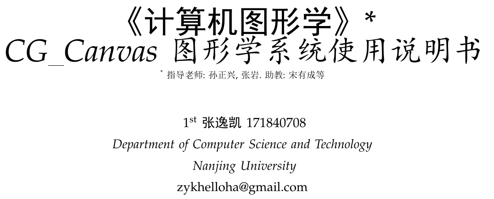

## 目录

[TOC]

## 摘要

---

图形学绘制系统CG_Canvas_171840708是南京大学计算机图形学的课程实验与大作业, **它集成了各种图形的绘制, 还提供各种操作例如裁剪, 取色, 填充, 缩放等, 另有3D效果展示.** 整个系统不仅对开发人员我深入学习图形学起到了很好的帮助, 还给使用者带来了很形象的图形展示体验, 可以应用到生活的各个方面.

**成果展示:**

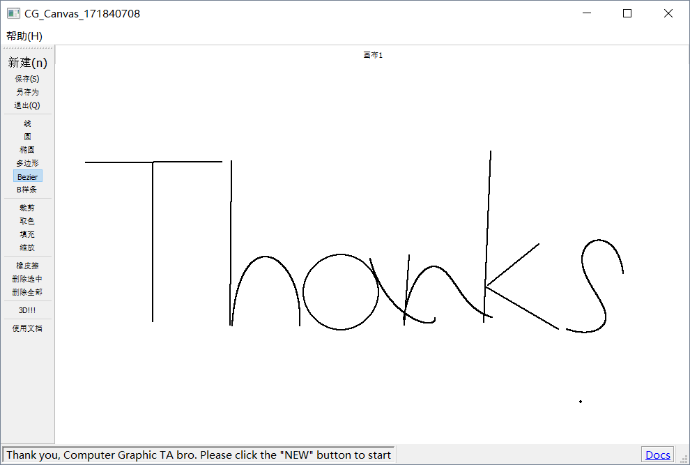

谢谢助教哥的审查!!!

### 软件环境与部署

------

操作系统: Windows 10.

*GUI版本*解压后点击`CG171840708.exe`文件即可运行. 绿色高效.

> *控制台版本*运行示例(`cmd`下命令行):
>
> `171840708.exe ./input.txt ./result/`
>
> 注意 `result` 输出文件的目录必须**存在.**

### 本说明书编制目的

本说明详细描述了CG_Canvas_171840708图形学绘制系统的概要设计与实现过程, 达到详细设计和开发的目的, 同时实现测试人员及用户的沟通.

本报告面向开发人员、测试人员及最终用户编写, 是了解系统的导航.

### 词汇表

| 词汇名称 |          词汇含义           | 备注 |
| :------: | :-------------------------: | :--: |
| 新版GUI  | 最后阶段调整GUI界面后的产品 | 支持旧版GUI全部操作, 有新增功能裁剪和填充, 布局更加方便简洁 |

## 产品概述

---

### 综述

计算机图形学是利用计算机研究图形的表示、生成、处理和显示的一门重要的计算机学科分支，它是计算机科学中最活跃的分支之一。近年来，随着计算机及互联网技术的迅速发展，计算机图形学正越来越深入我们的生活，它在图形视频处理，工业建模，游戏制作，生物信息，医药医疗等各行各业都有着及其重要的作用。

图形学绘制系统CG_Canvas_171840708是南京大学计算机图形学的课程实验与大作业, **它集成了各种图形的绘制, 还提供各种操作例如裁剪, 取色, 填充, 缩放等, 另有3D效果展示.** 整个系统不仅对开发人员我深入学习图形学起到了很好的帮助, 还给使用者带来了很形象的图形展示体验, 可以应用到生活的各个方面.

### 产品亮点

---

集成了**所有图形的绘制:** 

1. 线(DDA与Bresenham算法)
2. 圆(中点画圆算法)
3. 椭圆(中点椭圆算法)
4. 多边形(Bresenham算法)
5. Bezier曲线(任意控制点)
6. B样条曲线(三次均匀, 任意控制点).

对图元的操作丰富:

1. 裁剪(画出裁剪框后再次点击裁剪按钮)
2. 取色(带颜色的图形)
3. 填充(填充多边形, 圆形, 椭圆等)
4. 缩放(鼠标滑轮即可)

### 使用方法

#### 新建画布并绘制:

**新版GUI界面:** (*包含了所有图形的绘制方式*)

注意下面的gif**汇集了线, 圆, 椭圆, 多边形, Bezier, B样条的绘制**

---

11月报告阶段版本GUI展示(操作过程是相同的, 只是界面不同):

##### 线段与圆或椭圆

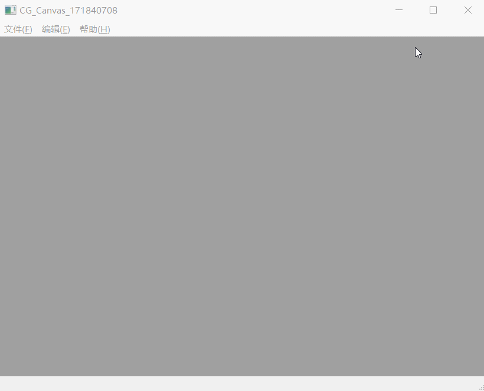

选择相应的绘图模式后, *通过鼠标拖拽的方式可以绘制各种简单图形.*

##### 多边形

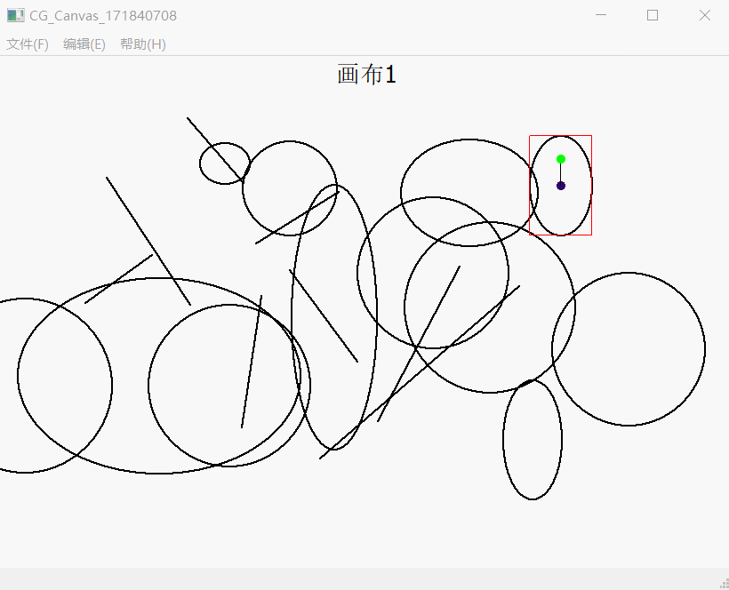

选择多边形模式后, *点击一个空白地方将确定多边形的某个顶点, 点击到起始点时完成绘画.*

##### 曲线

###### 任意`n`次`Bézier`曲线

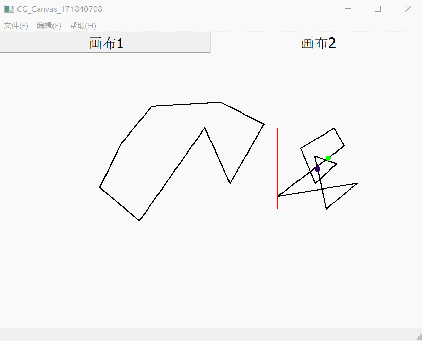

支持任意次数`Bézier`曲线的绘制, *点击`n`次来确定`n`个控制点的位置*, 点击结束即绘制完成.

##### 3D 图形!

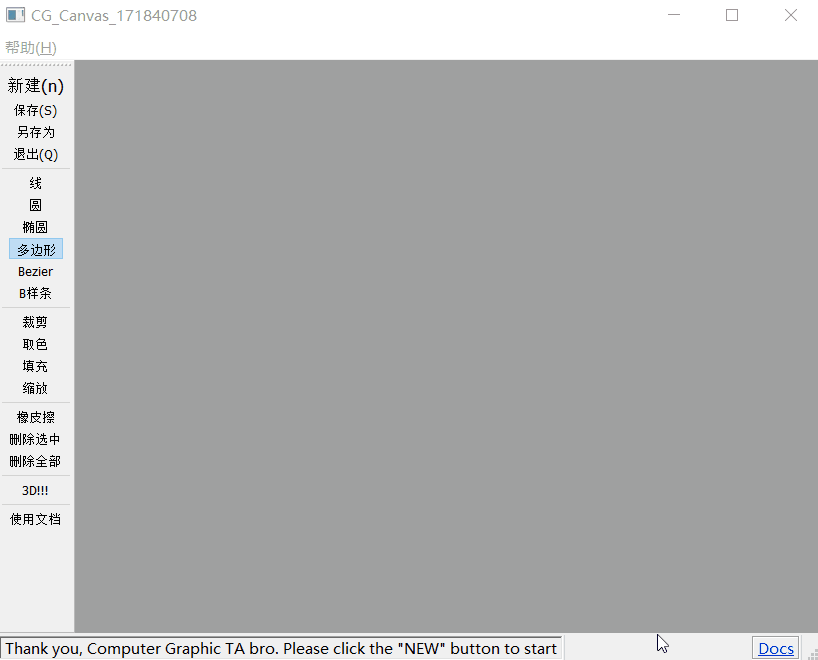

#### 选中并编辑:

选中的图形**带有旋转手柄标记**, 并且会**被*展示在最上面*(存在多个图形重叠时)**, 当鼠标点击位置与图形距离小于某个阈值时, 选中该图形.

**新版GUI:**

---

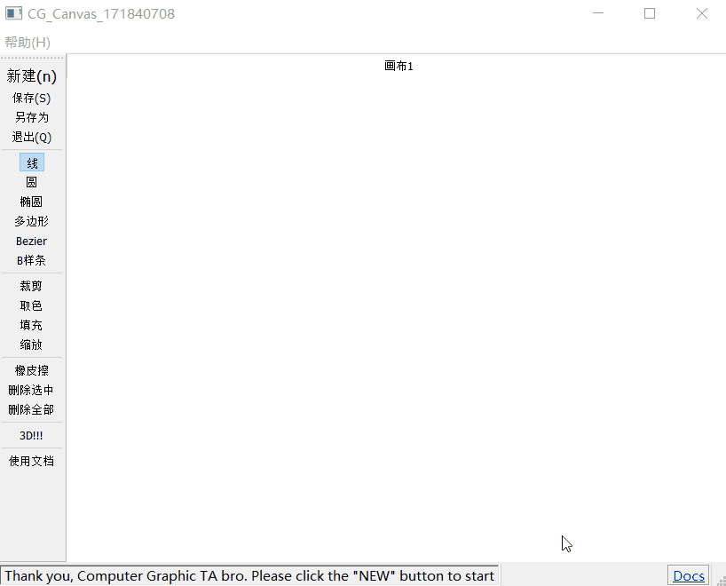

11月报告阶段版本GUI展示(操作过程是相同的, 只是界面不同):

##### 修改大小

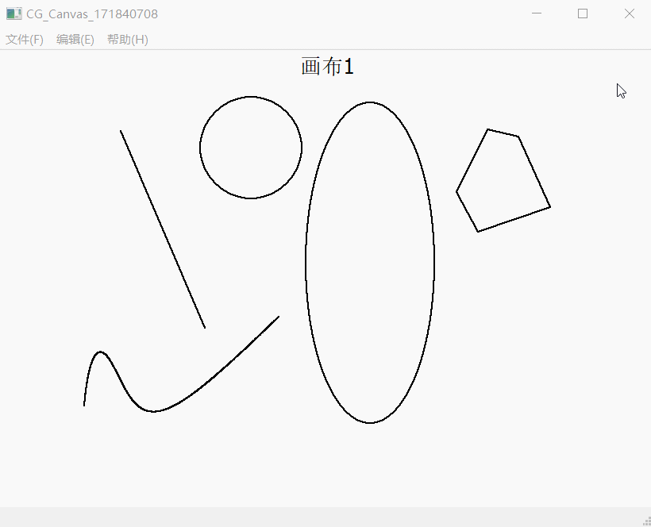

点击到图形上即选中图形, 在点击线段端点或者其他图形的控制框端点或者控制点, 即可改变图形形状以及大小.

##### 平移

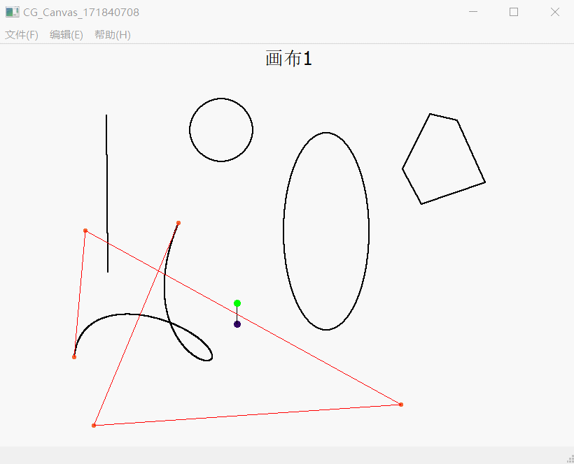

*按住图形中心*(南大紫的点), 即可完成平移拖动.

##### 旋转

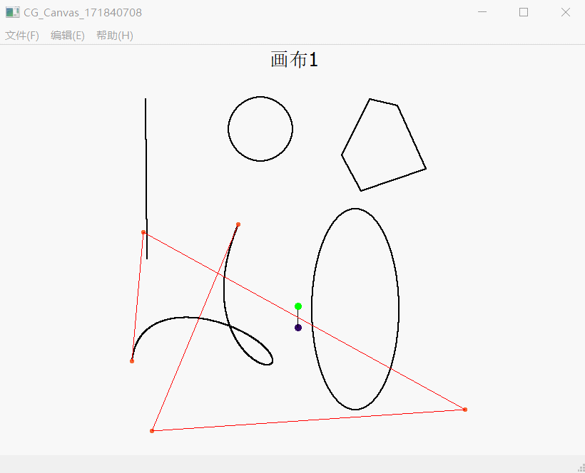

按住旋转手柄, 即可完成旋转.

##### 裁剪

**支持对多边形, 线段的裁剪:**

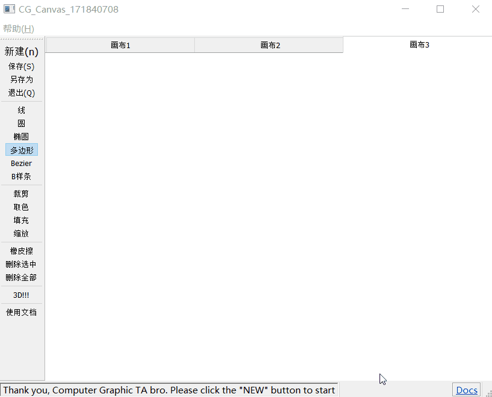

##### 缩放

新版支持对所有图形通过**鼠标滚轮**调整大小:

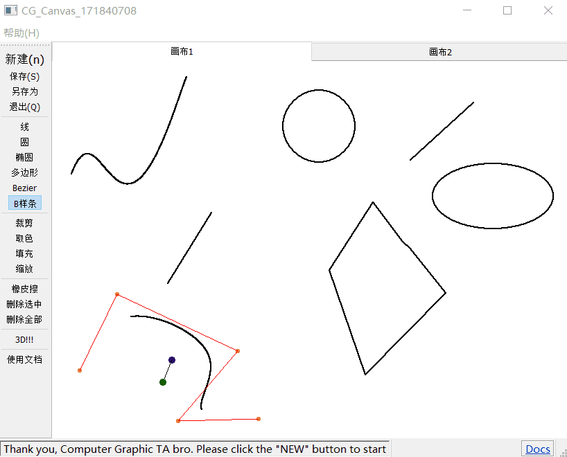

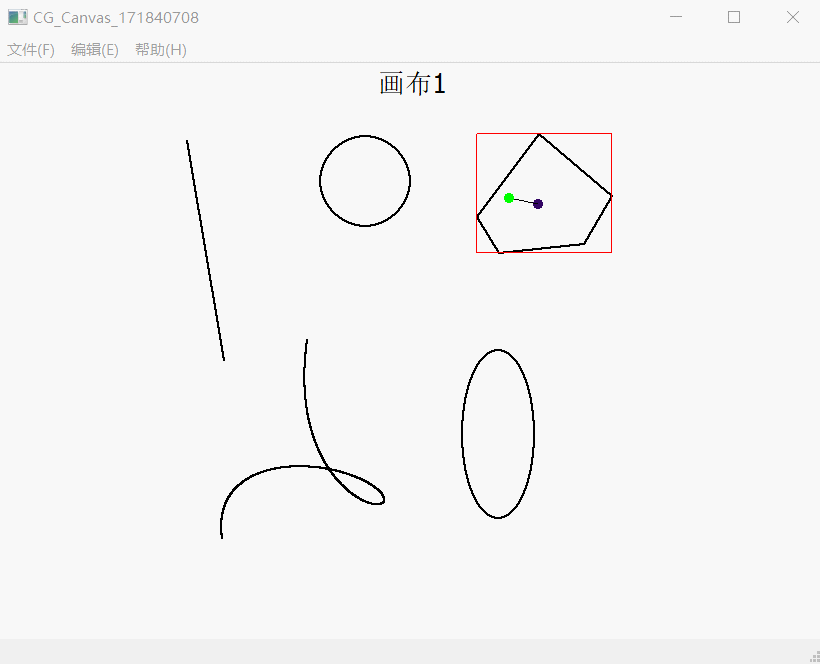

选中相应图形后, 可以调节或者设置缩放倍数, 点击`OK`后即完成对相应图形的缩放.

#### 着色:

##### 取色

*点击取色并选择相应颜色*来改变当前画笔颜色.

##### 填充

*点击取色并选择相应颜色*来改变当前填充油漆的颜色.

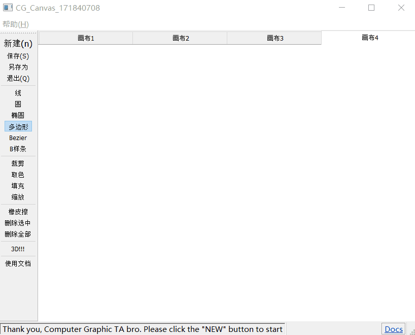

#### 删除:

11月报告阶段版本GUI展示(操作过程是相同的, 只是界面不同):

##### 橡皮擦

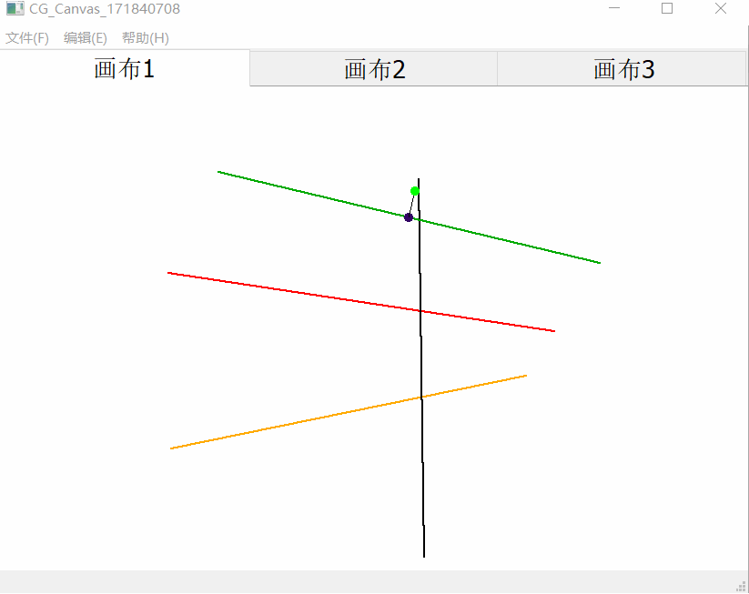

点击橡皮擦后可类似笔迹橡皮擦除画过的笔迹(图形).

##### 删除选中或全部

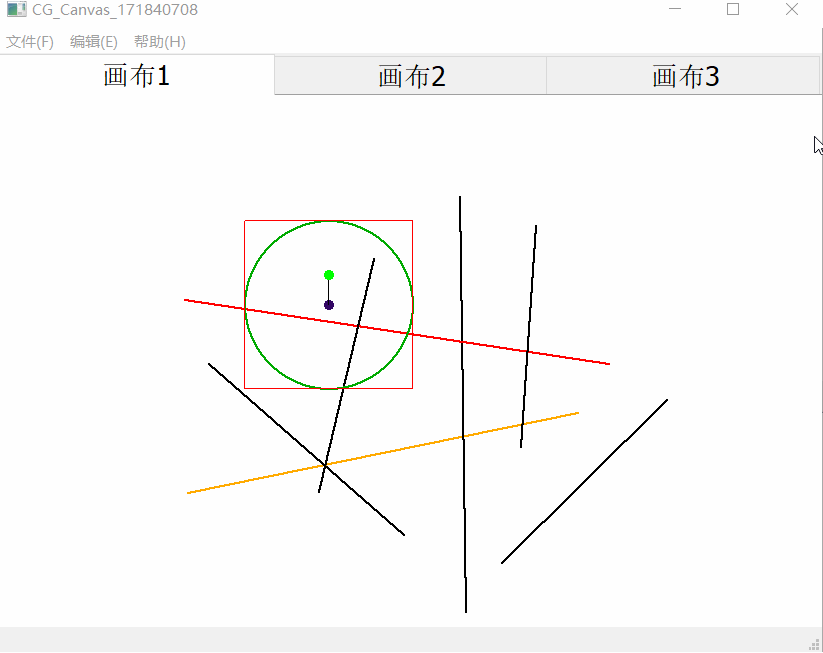

点击删除选中可以删除当前选中图形, 点击删除全部可以删除画布上所有图形.

### 项目更新过程

---

| 修改人员 | 日期      | 修改原因   | 版本号 |
| :------: | --------- | ---------- | ------ |
|   张逸凯   | 2019.10.29 | 初步测试版 | V1.0   |
|   张逸凯   | 2019.10.30 | 初步完整版 | V1.1   |
|   张逸凯   | 2019.11.10 | 第二阶段   | V1.2   |
|  张逸凯  | 2019.11.13 | 第二阶段   | V2.0   |
|  张逸凯  | 2019.11.18 | 第二阶段   | V2.1   |
|  张逸凯  | 2019.11.22 | 第二阶段   | V2.2   |
|  张逸凯  | 2019.11.23 | 第三阶段   | V2.3   |
|  张逸凯  | 2019.11.28 | 第三阶段   | V2.4   |
|  张逸凯  | 2019.11.29 | 第三阶段   | V2.5   |
|  张逸凯  | 2019.11.30 | 第三阶段   | V2.6   |
|  张逸凯  | 2019.12.09 | 最后阶段   | V3.0   |
|  张逸凯  | 2019.12.11 | 最后阶段   | V3.1   |
|  张逸凯  | 2019.12.15 | 最后阶段   | V3.2   |
|  张逸凯  | 2019.12.18 | 最后阶段   | V3.3   |

### 参考文献

---

[1] 计算机图形学, 孙正兴等.

[2] [https://en.wikipedia.org/wiki/Cohen%E2%80%93Sutherland_algorithm#Example_C/C++_implementation](https://en.wikipedia.org/wiki/Cohen–Sutherland_algorithm#Example_C/C++_implementation)

[3] http://www.pracspedia.com/CG/liangbarsky.html

[4] https://www.geeksforgeeks.org/line-clipping-set-1-cohen-sutherland-algorithm/

[5] [https://en.wikipedia.org/wiki/Weiler%E2%80%93Atherton_clipping_algorithm](https://en.wikipedia.org/wiki/Weiler–Atherton_clipping_algorithm)

[6] https://www.geeksforgeeks.org/weiler-atherton-polygon-clipping-algorithm/

[7] https://zhuanlan.zhihu.com/p/33444429

[8] https://www.tutorialspoint.com/computer_graphics/computer_graphics_curves.htm

[9] https://www.technicalsymposium.com/Computer_Graphies_BresenhamEllipse.html

[10] https://scikit-learn.org/stable/auto_examples/linear_model/plot_sparse_logistic_regression_20newsgroups.html

[11] [Introduction to Computer Graphics](https://open.umn.edu/opentextbooks/textbooks/introduction-to-computer-graphics)

[12] http://math.hws.edu/eck/cs424/downloads/graphicsbook-linked.pdf

[13] https://github.com/PKUanonym/REKCARC-TSC-UHT

[14] Computational Geometry: Algorithms and Applications, 3rd Edition

[15] Fundamentals of Computer Graphics, Third Edition https://book.douban.com/subject/3829906/

[16] http://www.opengl-tutorial.org/

[17] OpenGL Development Cookbook

[18] http://www.ecsponline.com/yz/BFEBE87EE54754ED396C3FB3500CEF217000.pdf

感谢华中科技大学, 中国农业大学提供的中国大学MOOC! 感谢孙正兴老师, 张岩老师的教导以及助教哥的答疑和批改!